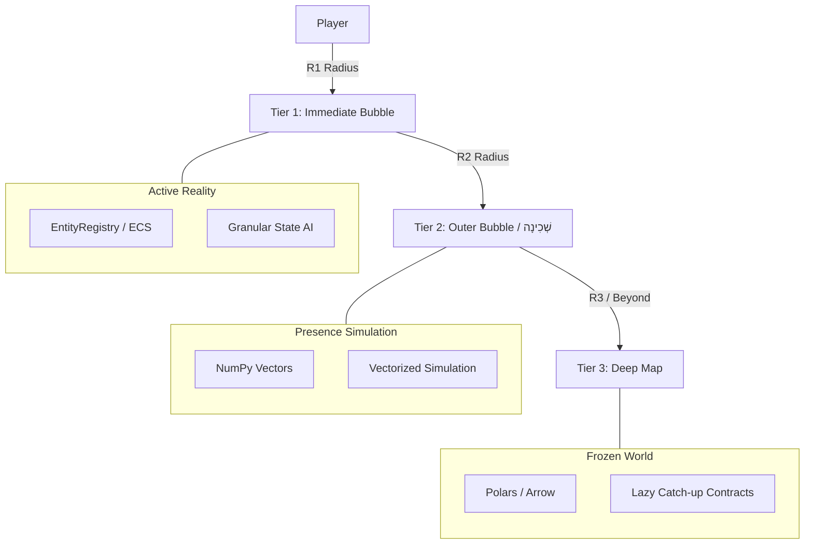

# Surface Map Plan

## Purpose

The current overland generator produces useful terrain, hydrology, settlement,
route, transition, and affordance data, but the playable layer needs a clearer
identity. The immediate gameplay target is not an abstract overland travel map.
It is a character-scale surface map where the player, NPCs, monsters, animals,
sound, scent, light, memory, and weather all operate in ordinary turn time.

This document defines the plan for that playable surface layer. It does not
replace the overland generator contract in
[Overland Generation](./Overland%20Generation.md). Instead, it describes how
generator outputs should be interpreted when converted into runtime play space.

## Problem

The word "overland" currently carries two conflicting meanings:

- regional worldgen data, such as hydrology systems, route candidates, settlement
  placement, cave handoff records, and archaeology evidence
- the runtime `GameMap` the player actually walks around in

That ambiguity causes scale problems. A map that is framed as Alaska- or
Greenland-scale cannot also be read as tile-by-tile character space without
losing coherence.

The target is CDDA-like in the sense described by
[Persistent Player-Scale Map Systems: CDDA-like Technical Overview](./cdda-like-maps-technical-overview.md):
the strategic or regional layer is a semantic promise, while the local layer is
a durable player-scale rules surface. In this project, that means the region
generator may say "road," "harbor," "spring," "forest," "ruin," or "cave," but
the surface map must resolve those promises into concrete tile space where
actors, objects, scent, sound, light, hazards, and player changes persist. If
NPCs, animals, monsters, and the player all occupy this layer, then it must be
planned as a local surface simulation layer first.

## Naming

Use these terms in new code and docs:

- **Region generator**: the worldgen producer that emits terrain, hydrology,
  features, settlements, routes, affordances, transitions, and metadata.
- **Surface map**: the character-scale runtime map derived from generator data.
  This is a `GameMap` with surface metadata attached.
- **Travel map**: a possible future abstraction for long-distance movement
  between known sites. It is not the current playable surface layer.

Existing `overland_*` code does not need to be renamed immediately. New runtime
work should use "surface" terminology when the behavior is actor-scale.

---

## Global Coordinates & Surface Chunking

To support infinite travel and absolute persistence in a character-scale world, the surface map is divided into a grid of discrete, three-dimensional **chunks**.

### Coordinate Systems
1. **Global Tile Coordinates** $(X_g, Y_g, Z_g)$: A character-scale grid representing individual walkable tiles across the entire world, relative to the absolute origin $(0,0,0)$. $Z_g = 0$ represents the default surface layer, $Z_g < 0$ represents subterranean layers (e.g. caves), and $Z_g > 0$ represents elevations (e.g. towers, mountain peaks).
2. **Chunk Coordinates** $(C_x, C_y, C_z)$: The coordinate of the chunk containing the global tile.
3. **Local Tile Coordinates** $(X_l, Y_l, Z_l)$: The tile index within its respective chunk.

### Transformation Equations
Let $S_c$ represent the chunk dimension (width and height), which must be a configurable parameter (default $S_c = 64$):

$$C_x = \lfloor X_g / S_c \rfloor, \quad C_y = \lfloor Y_g / S_c \rfloor, \quad C_z = Z_g$$
$$X_l = X_g \bmod S_c, \quad Y_l = Y_g \bmod S_c, \quad Z_l = 0 \text{ (local offset inside layer } C_z)$$

### Stable Chunk Identity
Every chunk is assigned a unique, immutable string identifier formatted as `chunk_{Cx}_{Cy}_{Cz}` (e.g. `chunk_3_-12_0` for the surface, `chunk_3_-12_-1` for a cave layer). This ID serves as the key for persistent files and runtime cache lookups.

### Chunk Scaling & Expected Playable Area
- **Region Scaling**: One regional cell from the overland generator maps to exactly a $1 \times 1$ surface chunk of $64 \times 64$ local character-scale tiles. This establishes a fixed, unambiguous scale mapping.
- **First Playable Area**: The initial gameplay region loads a $3 \times 3$ grid of chunks ($192 \times 192$ character-scale tiles) centered on the player's spawn point (the harbor and surrounding ruins).
- **Feature Density Constraints**:
  - Max 1 primary settlement structure or ruin cluster per chunk (occupying up to a $30 \times 30$ bounding box).
  - Max 3 minor affordance anchors (e.g., caves, springs, forage patches).
  - Ambient debris and obstacles (trees, rocks, mudflats) covering up to 30% of the remaining walkable space.

### Deterministic Seed Derivation
To prevent process-unstable hashing, every chunk receives a unique, reproducible generation seed derived using `hashlib.sha256`:
- **Inputs**:
  - `world_seed`: Unique global world identifier (integer or string).
  - `Cx, Cy, Cz`: 3D chunk coordinates.
  - `content_version`: Version identifier of content templates (integer).
  - `generation_version`: Code version of generator rules (integer).
- **Formula**:
  ```python
  import hashlib
  seed_bytes = f"{world_seed}:{Cx}:{Cy}:{Cz}:{content_version}:{generation_version}".encode()
  chunk_seed = int(hashlib.sha256(seed_bytes).hexdigest(), 16) % (2**32)
  ```
  This guarantees that terrain generated procedurally on-the-fly remains identical when re-generated.

### Border Stitching
Adjacent chunks must align perfectly without seams or visual tears:
- Roads, coastlines, and biomes are determined by querying the immutable regional Polars/Arrow overland map.
- When generating local details along chunk boundaries, the generation algorithm queries a 1-chunk boundary buffer from adjacent coordinates to ensure features (such as walls, fences, or rivers) flow continuously.

---

## Simulation Level of Detail (LOD) & Authority

To scale performance across a massive character-scale world, the surface simulation is structured in three concentric, dynamic tiers:



### The Three-Tier Architecture

| Tier | Name | Technology | Simulation Level | Authority Scope |
| :--- | :--- | :--- | :--- | :--- |
| **Tier 1** | Immediate Bubble | Python objects, EntityRegistry | Granular turn-by-turn. Real pathfinding, line-of-sight, state AI. | Full authority over tiles, items, and active actors within $R_1$ distance of player. |
| **Tier 2** | Outer Bubble / שְׁכִינָה | Dense, mutable NumPy arrays | Vectorized batch steps (e.g. update positions every $N$ turns). | Coarse authority over positions and status of regional entities within $R_2$. |
| **Tier 3** | Deep Map | Polars DataFrames & Save-Diff Journals | Frozen. Lazily appends macro event logs and catch-up scripts. | Read-only base generator truth + Save-Diff Journals. |

### Hydration & Dehydration Contracts

To prevent data duplication and competing sources of truth, state transitions between tiers must follow strict transfer rules:

```
                  Hydration Flow (Enter R1)
   Deep Map / NumPy  ===================>  EntityRegistry (ECS)
   (Polars/Vectors)  <===================  (Active Python Objects)
                 Dehydration Flow (Exit R1)
```

1. **Hydration (T3/T2 -> T1)**:
   - When a chunk enters the Immediate Bubble ($R_1$), the system queries the **Save-Diff Journal** for tile mutations and the NumPy records for resident actors.
   - Actors are instantiated as active Python objects in the `EntityRegistry`.
   - The chunk's tiles are populated, and the ECS takes absolute authority.
2. **Dehydration (T1 -> T2/T3)**:
   - When a chunk exits the Immediate Bubble ($R_1$), all active actors resident in that chunk are serialized into compact records (stored in NumPy arrays for Tier 2 or written to the Save-Diff Journal for Tier 3).
   - Their active Python objects are deleted from the `EntityRegistry`.
   - Any tile changes are saved to the Save-Diff Journal.
3. **Stable Identity Model**:
   - Every actor gets a unique, stable UUID or integer ID at birth.
   - This stable ID is preserved through all hydration/dehydration cycles, preventing identity drift and ensuring an actor's history (health, faction, inventory) remains identical.
4. **Abstract Populations vs. Hydrated Actors**:
   - **Abstract population records** (e.g. a general counter representing "10 wolves in this forest region") belong to the Outer Bubble or Deep Map and are simulated coarsely (e.g. random migrations).
   - **Hydrated actors** (e.g. "Wolf #5345 with 12 HP and a scarred left leg") are individual entities. When they are dehydrated, they exist *only* as serialized records in their chunk file or NumPy table. They are *never* double-simulated by both the vectorized Outer Bubble and the ECS registry.
5. **Conflict Resolution**:
   - The active `EntityRegistry` is the sole source of truth for all entities inside the Immediate Bubble.
   - If a dehydrated entity is moved by a regional simulation (e.g. migrations) and lands on an occupied tile upon hydration, the hydration manager shifts it to the nearest walkable tile.

### Sequential LOD Roadmap
To manage implementation complexity, the simulation layers will be introduced progressively in four distinct milestones:
- **Milestone A (Phase 1 & 2)**: Fixed-radius chunk loading/unloading (active bubble radius $R_1$ is a constant configuration setting). Base terrain loads procedurally, and local modifications load/save via the Save-Diff Journal.
- **Milestone B (Phase 3)**: Actor Dehydration. Serializing active entity attributes to disk files when their containing chunk is unloaded, and restoring them upon reload.
- **Milestone C (Phase 4)**: NumPy Presence Simulation. Vectorized batch updates for the Outer Bubble ($R_2$) to handle migrations and coarse movements.
- **Milestone D (Phase 5)**: Dynamic Auto-Scaling. Adaptive resizing of $R_1$ and $R_2$ based on rolling frame-time performance markers.

---

## Data Immutability & Persistence (Save-Diff Journals)

### The Immutability Contract
All output files produced by the region generator (Polars/Arrow/Parquet data representing biomes, routes, settlements, and base topography) are **strictly immutable**. Running gameplay must never overwrite these files.

### Save-Diff Journal Storage Mechanics
Any modification to the world (terrain broken, doors opened, items dropped, trees chopped) is recorded as a **Mutation Overlay** in the chunk's **Save-Diff Journal**.

- **Format & Serialization**: Journals are saved in a compact, structured format (JSON or Msgpack) per chunk. Every journal file begins with a header block:
  ```json
  {
    "schema_version": 1,
    "chunk_id": "chunk_3_-2_0",
    "timestamp": 1781669340
  }
  ```
- **Atomic Writes**: Save-Diff files are written to a temporary file in the same directory, then renamed atomically using OS-native calls (`os.replace`) to prevent corruption during power loss or application crashes.
- **Corruption Handling**: Keep a `.bak` backup file alongside the primary file. If loading the primary file fails, the engine falls back to `.bak`. If both fail, it logs the failure and falls back to generating the base chunk (sacrificing player mutations but preventing crash loops).
- **Compaction & Snapshots**: If the change event log exceeds a threshold (e.g., 500 mutation events), the engine compacts the mutations directly into a static state overlay map and truncates the event log to save space.
- **Delta Categorization**: Data in the journal is strictly divided into distinct tables:
  - `tile_mutations`: `(x, y) -> new_tile_type_id`
  - `item_deltas`: `(x, y) -> {"added": [items], "removed": [item_ids]}`
  - `entity_snapshots`: `entity_id -> serialized_state_dict`
  - `player_knowledge`: `(x, y) -> revealed_bool`

### Unloaded Regions & Catch-Up Contract
When a player returns to a chunk that was unloaded for $T$ turns:
- The system checks the timestamp of when the chunk was dehydrated: $\Delta t = t_{\text{current}} - t_{\text{unloaded}}$.
- A **Migration/Catch-Up Contract** calculates changes that occurred during the elapsed $\Delta t$ using a whitelisted set of cheap deterministic rules:
  - **Whitelisted Cheap Catch-Up (Immediate)**:
    - Actor status decay/regeneration: hunger, thirst, natural healing, status effect expiration using simple formulas: $Stat_{new} = Stat_{old} \pm Rate \times \Delta t$.
    - Vegetation/Crop growth: advancing discrete growth stages based on $\Delta t$.
  - **Deferred Complex Catch-Up (Deferred / Non-Goals)**:
    - Spatial fire propagation, fluid flood spread, and animal herd migrations across unloaded chunks are frozen at the boundaries. They do *not* run background spatial calculations. They are suspended until their containing chunks are hydrated, or they are processed via simple, non-spatial regional event triggers.
- These changes are recorded in the Save-Diff Journal and entity records *before* hydration.

---

## Dynamic LOD Auto-Scaling Invariants

To keep performance smooth while maintaining world consistency and replay determinism, the radii $R_1$ and $R_2$ can adjust dynamically under the following strict invariants:

1. **Eviction Lock**: The engine must *never* evict or dehydrate entities that are visible to the player, audible (within hearing threshold), or engaged in active gameplay interactions (e.g. hostiles in combat, NPCs in conversation).
2. **Observable Determinism Invariant**: Dynamic bubble scaling must *never* alter or invalidate already-committed player-observable facts. If an entity is simulated coarsely in the Outer Bubble, when they re-enter the active bubble, their status is resolved through deterministic catch-up rules before they are presented to the player.
3. **Minimum Sizes**: The Immediate Bubble ($R_1$) has a hard floor limit of:
   $$R_1 \ge \max(\text{Viewport Width}, \text{Viewport Height}) + 10 \text{ tiles}$$
4. **Save/Load Compatibility**: The saved game structure must be entirely independent of the active bubble sizes. A game saved with $R_1 = 15$ must load and run perfectly on a system configured with $R_1 = 30$.

---

## SurfaceContext Semantic Query Verbs

The `SurfaceContext` class serves as the sole API seam wrapping the underlying `GameMap` and `overland_metadata`. It exposes the following verb-level query methods for gameplay systems:

- `can_walk(actor_profile, x, y) -> bool`: Checks walkability according to actor constraints (on foot, flying, swimming).
- `can_dig(x, y) -> bool`: Returns `True` if material is diggable (soil, mud, sand) vs. solid rock (limestone, basalt).
- `can_burn(x, y) -> bool`: Evaluates if the tile is flammable.
- `can_forage(x, y) -> bool`: Checks for food/material affordances.
- `has_shelter(x, y) -> bool`: Evaluates if the tile is covered by overhead roofs/enclosures.
- `can_track(x, y) -> bool`: Evaluates if the material retains footprint impressions (mud, snow, sand) vs. hard stone.
- `sound_conductivity(x, y) -> float`: Material-based dampening multiplier for acoustic propagation.
- `scent_permeability(x, y) -> float`: Wind/terrain dampening multiplier for scent spread.
- `is_valid_spawn_anchor(spawn_profile, x, y) -> bool`: Confirms the tile is valid for initial spawning of specific templates.

---

## Implementation Phases

### Phase 1: Foundational Coordinates, Stitching, & Semantics API

Goal:
```text
Establish the surface chunk coordinate systems, border stitching, and a clean semantics 
query API (SurfaceContext) so all subsequent phases consume runtime meanings directly.
```

Tasks:
- Implement the coordinate transform functions (`global_to_local`, `local_to_global`, `chunk_coordinates`) in 3D.
- Create `SurfaceContext` query class to wrap verb queries (`can_walk`, `can_dig`, `can_burn`, `can_track`, `sound_conductivity`, `scent_permeability`, `is_valid_spawn_anchor`).
- Keep the `GameMap.overland_metadata` as the backing data structure, routing queries through `SurfaceContext`.
- Write unit tests verifying chunk boundary stitching and coordinate calculations.

### Phase 2: Save-Diff Journals & Absolute Persistence

Goal:
```text
Provide absolute persistence for terrain changes, items, and structures using 
immutable worldgen data combined with JSON/Msgpack mutation overlays.
```

Tasks:
- Define the `SaveDiffJournal` structure for representing tile and terrain mutations with header versioning and atomic replace.
- Implement the chunk serializer and deserializer (using JSON or Msgpack) with `.bak` recovery.
- Write a terrain-modification interceptor that writes all gameplay changes to the current chunk's journal.
- Create tests verifying that a chunk can be modified, unloaded, reloaded, and matches its modified state perfectly.

### Phase 3: Three-Tier LOD & Hydration Flow

Goal:
```text
Implement hydration/dehydration mechanics for entities moving between the 
Immediate Bubble (ECS), Outer Bubble (NumPy), and Deep Map (Journals), using stable IDs.
```

Tasks:
- Add a stable identity tracking mapping to `EntityRegistry`.
- Implement hydration (`hydrate_chunk_entities`) and dehydration (`dehydrate_chunk_entities`) routines.
- Implement eviction locks ensuring visible/engaged actors are never dehydrated.
- Add validation checking that entity state (HP, inventory) is preserved across hydration cycles.

### Phase 4: Deterministic Population & Living Behavior

Goal:
```text
Populate the surface map with deterministic NPCs, wildlife, and monsters using the 
SurfaceContext API, and give them simple, context-aware behaviors.
```

Tasks:
- Create actor templates for humans, wildlife, and monsters.
- Use `SurfaceContext` to place entities near logical starting anchors (e.g., port survivors near settlements, wildlife near springs).
- Create basic AI behaviors: animals seeking water/forage biomes, monsters remaining near caves/hazards.
- Verify actors participate in the normal turn loop and respect surface bounds.

### Phase 5: Dynamic LOD Auto-Scaling

Goal:
```text
Enable dynamic expansion and contraction of simulation bubbles based on frame-times 
while maintaining the defined safety invariants.
```

Tasks:
- Build a frame-time monitoring system.
- Implement dynamic radius adjustment for $R_1$ and $R_2$ based on rolling processing times.
- Assert the Eviction Lock and Sizing Bounds invariants under heavy simulated load.

### Phase 6: Knowledge & Survey Integration

Goal:
```text
Integrate local surface maps with the exploration, survey, and evidence tracking systems.
```

Tasks:
- Map NPC, monster, and wild animal movements to local tracks and evidence nodes.
- Save player discovery and map knowledge separately from base generation data.

---

## Verification Plan

All features will be validated through automated pytest suites.

### Automated Unit and Integration Tests

The following named tests will be implemented:

- `test_surface_coordinate_transforms`:
  Verifies correctness of global-to-local and local-to-global translations across positive, negative, and edge-case coordinates in 3D.
- `test_surface_seed_determinism`:
  Asserts that SHA-256 chunk seeds are stable across multiple processes and match identical inputs.
- `test_surface_z_axis_coordinates`:
  Verifies coordinate transform mappings in 3D space.
- `test_surface_context_verb_queries`:
  Asserts that `SurfaceContext` correctly evaluates `can_dig`, `can_track`, `sound_conductivity`, and other query verbs.
- `test_surface_chunk_reload_preserves_mutations`:
  Asserts that modifying a tile (e.g. digging a wall), unloading the chunk, and reloading it preserves the modifications.
- `test_save_diff_atomic_replacement`:
  Simulates interrupted writes and asserts that backup recovery prevents save corruption.
- `test_hydrate_dehydrate_actor_identity`:
  Verifies that an entity's stable ID, health, inventory, and active status are preserved without duplication when moving in and out of the Immediate Bubble.
- `test_lod_bubble_dynamic_scaling_invariants`:
  Asserts that reducing bubble size ($R_1$) does not evict visible or engaged entities, and that save states remain compatible.
- `test_whitelisted_catch_up_decay`:
  Validates that when a chunk is reloaded, the migration catch-up contract applies correct elapsed time changes (e.g. hunger calculations) using the cheap deterministic whitelist.

---

## Non-Goals

This plan does not require:
- Renaming every existing `overland_*` symbol immediately.
- Replacing the overland generator.
- Building a continent-scale travel UI.
- Implementing full ecology, schedules, or economy before basic population.
- Moving settlement generation out of its current producer role.
